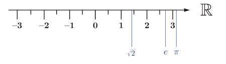

## README.md file for project Quaternion

NOTE :

If this file doesn't render properly in your browser, then please consider using another
browser to try and view it. The reason this has been mentioned, is because some of the
mathematical symbols which are used within this file, may cause problems for certain
browsers, especially when it comes to the rendering of blackboard characters.

See reference 1) for more information about this issue.


* ### What are quaternions?

The field of mathematics contains many different types of mathemetical structures.
Some of them - such as vectors, matrices, and complex numbers for example, are rather well known.
Others however, are rather less well known, with quaternions being one such example.
But what are quaternions exactly, and how is it that they act as a mathematical structure?

Let us attempt to answer these questions, by first recalling how
complex numbers are comprised of two parts - one real part and one imaginary part. Quaternions are
alot like complex numbers, except that rather than being comprised of two parts, they are instead comprised of 
four - one real part and three imaginary parts. It is for this reason that quaternions

When we say "real part" in the context of complex numbers
and quaternions, what we actually mean is a real number. Similarly, when we say "imaginary part"
in this same context, what we actually mean is an imaginary number.

You might also recall that an imaginary number is usually denoted by the letter $i$ and is defined
as being equal to the square root of -1. That is;

```math
i = \pm\sqrt{-1}
```


* #### Imaginary numbers and their place on the number line.

We can think of the real number line as actually being part of a bigger number line. To try and help illustrate
what is meant by this, consider the following figure.



Figure 2) A graphical depiction of the real number line $\mathbb{R}$. In reality, this number line should extend 
to infinity in either direction.

This figure presents a graphical depiction of the real number line $\mathbb{R}$. Many numbers reside on 
this real number line, including irrational numbers such as $\sqrt{2}$, $e$ and $\pi$. However, not all numbers
reside on this line, and the imaginary numbers are the best example of this case. This then begs the question; if the
imaginary numbers don't reside on this number line, then where do they reside? The answer is that they 
reside on an adjunct or alternate number line which we call the imaginary number line. To depict these two number 
lines graphically, we can arrange them in an
orthogonal manner as shown below. In this case, we have labelled the number line $x$, such that the real
component of the number line is labelled $Re(x)$ and the imaginary component of the number line is labelled
$Im(x)$. Such a graphical arrangement of these two number lines - or should we say two components of the same number
line, is referred to as an Argand diagram.


Figure 2) The graphical arrangement depicted in this figure, shows the two components of the same number line $x$ 
being arranged such that they are orthogonal to each other. The real
component of the number line is labelled $Re(x)$ and the imaginary component of the number line is labelled
$Im(x)$. Such an arrangement of the two components of the number line is referred to as an Argand diagram. 

* #### Relationship between different types of numbers.


Figure 1) 


Figure 3) A graphical depiction of a 3-dimensional co-ordinate system with its three axes labelled $x$, $y$, and $z$ respectively.
A problem arises with this depiction however, when we attempt to find where $\sqrt{x}$ should live within the 
co-ordinate system when $x=-1$. The reason is that the $x$-axis only caters for numbers whose values are real - not
numbers whose values are imaginary. The same problem also arises for $\sqrt{y}$ and $\sqrt{z}$ when $y=-1$ and $z=-1$
respectively. The rectify this problem, these required three imaginary number lines will need to be depicted
in a 3-dimensional co-ordinate system which lives or resides within a parallel or alternate realm. 

Quaternions are most often presented in the literature, using a format which is similar to the
following;

```math
q = a + ib + jc + kd
```

where the $a$ represents the real part of a quaternion and is referred to as a scalar, while 
$ib + jc + kd$ represent the three imaginary parts of a quaternion and are referred to collectively
as a vector.

To help distinguish all three of the imaginary parts of a quaternion from one another - as well as
from the scalar, the unit values $i$, $j$, and $k$ are associated with each of the three
imaginary parts. $i$ is simply equal to the $\sqrt{-1}$ as we saw a moment ago, while $j$ and $k$
are also equal to the $\sqrt{-1}$ and serve the same role for each of the other two imaginary
parts of a quaternion as $i$ does for the first imaginary part.

You can probably start to see by now why quaternions are called such. If you haven't worked it out, it
is because they are comprised of four parts, and the prefix "quater" relates to the Latin word for four.

An interesting point which is worth making, is that any quaternion which has its scalar part equal to 0,
is called a "pure quaternion". The mathematical space which quaternions reside in - or inhabit, is known
as the Hamiltonian and is represented by the blackboard character $\mathbb{H}$. This space is named after
the mathematician who invented quaternions, the Irishman William Rowan Hamilton. According to ChatGPT,
$\mathbb{H}$ forms a 4-dimensional real-valued vector space, and has the following basis;

```math
\{1,i,j,k\}
```

that is, these act as the units for each one of a quaternion's four dimensions.


* ### Some basic laws governing quaternions.

The $i$, $j$, and $k$ in the definition of the quaternion above, are all equal to the $\sqrt{-1}$. As a
result of this, we can state this fact rather succinctly, as follows;

```math
i^{2} = j^{2} = k^{2} = -1
```

Furthermore, the following relationship also holds for $i$, $j$, and $k$.

```math
ijk = -1
```

This is because;

```math
ij = k
```
```math
jk = i
```
```math
ki = j
```

and if you plug any one of these three equations into the former equation, then you end up with the equation
before that.

The act of multiplying quaternions together isn't commutative. This means that the following equations
also hold true for quaternions;

```math
ji = -k
```
```math
kj = -i
```
```math
ik = -j
```


* #### Quaternion units, i.e. $i$, $j$, $k$ and the sphere of solutions for $\pm\sqrt{-1}$.

We saw above that;

```math
i^{2} = j^{2} = k^{2} = -1
```

This then begs the question; if we take $\sqrt{-1}$, what is the answer? Is it $\pm i$, $\pm j$, or $\pm k$? Any
of them would appear to be possible. Furthermore, if we consider the $i$, $j$, and $k$ axes as forming 
a 3-dimensional space, then any of these six points would appear to reside on the surface of a sphere whose radius is
1, and which is centred on the origin of these three axes. Such a sphere with a unit radius - a radius in this
case equal to a unit value of 1, is called a unit sphere. 

But what about all of the other points that reside on the surface of this unit sphere, but don't happen to reside
on one of the three axes? Do these points form a sort of "composite" solution to the problem of finding $\sqrt{-1}$?
The answer is yes.

To help illustrate why, consider the following point;

```math
i\frac{1}{\sqrt{3}} + j\frac{1}{\sqrt{3}} + k\frac{1}{\sqrt{3}}
```

This point should have a distance from the origin of the $i$, $j$, and $k$ axes which is equal to 1. We can
confirm this as follows;

```math
\sqrt{\Biggl(i\frac{1}{\sqrt{3}}\Biggr)^{2} + \Biggl(j\frac{1}{\sqrt{3}}\Biggr)^{2} + \Biggl(k\frac{1}{\sqrt{3}}\Biggr)^{2}}
```
```math
\sqrt{\frac{i^{2}}{3} + \frac{j^{2}}{3} + \frac{k^{2}}{3}}
```
```math
\sqrt{\frac{-1}{3} + \frac{-1}{3} + \frac{-1}{3}}
```
```math
\sqrt{-1}
```

and recall that;

```math
i = j = k = \sqrt{-1}
```

Since this point has a distance of $1$ from the origin of the $i$, $j$, and $k$ axes,
it will also reside on the surface of the unit sphere mentioned above.


* #### Unit quaternions - as opposed to quaternion units.

It is all well and good to talk about the unit sphere and how points
on its surface are all solutions to the problem of $\sqrt{-1}$, but the trouble is that it only takes
into account three of the four dimensions which comprise quaternions. How then might we possibly visualise
4-dimensional quaternions? The video which can found [here](https://eater.net/quaternions/video/intro),
attempts to do just such a thing. In this video, the narrator mentions the term "unit quaternions".
But what exactly is a unit quaternion? It is a quaternion which has a magnitude of $1$ - or more precisely,
it is a quaternion where the sum of the squares of all four components equals $1$. That is, for the
quaternion $q$ which is defined as;

```math
q = a + ib + jc + kd
```

the sum of the squares of all four components will be equal to $1$ as follows;

```math
\sqrt{a^{2} + b^{2} + c^{2} + d^{2}} = 1
```

If we plot all of the unit quaternions in the $i$, $j$, and $k$ space that we talked about above, then
we will end up with a sphere as shown at the start of this video. However, it must be noted that in this
video, the axes aren't labelled as $i$, $j$, and $k$ but as $x$, $y$, and $z$. This is correct, but don't
be misled by it - the sphere shown in the video exists in purely hyper-imaginary space.

Don't be fooled by this video, as it is not actually just a video per se. It can also act a web applet 
if you pause the video. Once you have done this, you can begin to interact with the applet and select which
items you would like to have the applet rotate. You select such items by using the field which is labelled $p$.
This field can be found in the top left corner of the applet, and it is actually a GUI control
that is implemented as a dropdown box - or more simply, a dropdown. Once you click on this dropdown, it
should present you with a list of those items that can be added into the display window to be rotated by the
the applet.

Note that this applet uses the following formula to calculate the rotation for any item that is listed within $p$.

```math
p' = qpq'
```

If you don't pause the video referred to just above, and therefore not use it as an interactive app, then
it will begin by depicting a unit 

If we were to now remove the $j$ and $k$ axes from this 3-dimensional vector space, all that we would
be left with would be the $i$ axis, which we refer to as the imaginary number line. Only two points from
our unit sphere reside on this axis, and they are $\pm i$.

When considered from the perspective of the 1-dimensional real number line, there are no solutions to
the problem of $\pm\sqrt{-1}$. Of course, there must be solutions to this problem, otherwise the 
following equation would be illegitimate;

```math
5 + x^{2} = 4
```

Over time however, mathematicians overcame this shortcoming by developing imaginary numbers. From these
imaginary numbers, complex numbers followed - neither of which can be represented on a real number line. Instead,
they need to be represented in a 2-dimensional complex number plane, which can be plotted on a 
2-dimensional graph known as an Argand diagram. Within this 2-dimensional complex number plane, there
are two solutions to the problem of $\pm\sqrt{-1}$ -- $i$ and $-i$. It is worth mentioning that
the 1-dimensional real number line which we discussed above, can be thought of as a small
component of the 2-dimensional complex number plane. Hold onto this thought, as we will return
to it in just a moment. 

In complete contrast to the complex number plane, which - as we just saw, yields only two solutions to our 
problem, the 4-dimensional real number space which forms the Hamiltonian, yields infinitely many solutions to the
problem of $\pm\sqrt{-1}$. $i$ is one solution, but $j$ is also another solution, and so is $k$.


* ### Quaternion noncommutativity and electric charges moving in magnetic fields.

NOTE SURE ABOUT THE FOLLOWING MATERIAL.

This noncommutative property of quaternions is rather interesting. 

The act of an electric charge moving through a magnetic field is also noncommutative.
If you think about what happens to
an electric charge when it passes through a magnetic field, this is also noncommutative. A positive
charge moving through a magnetic field in a specific direction, will get deflected in a certain direction.
However, if a negative charge moves through this exact same magnetic field, in the exact same direction,
then it will get deflected in a direction which is $180^{\circ}$ opposite.
 

* ### Quaternions and their relationship to complex numbers.

Quaternions are an extension of the complex numbers, the latter of which
are most often presented in the literature in a manner which is similar to the following;

```math
c = a + ib
```

You can see from this that if a given quaternion has values of $c$ and $d$ equal to 0, then it
degenerates into a complex number. Since quaternions are an extension to complex numbers,
they are often referred to as "hypercomplex numbers". Other examples of hypercomplex numbers
include octonions and sedenions, and just as quaternions are examples of mathematical structures, so
too are octonions and sedenions.


* ### Evolution of natural numbers to complex numbers.

One of the reasons complex numbers exist, is because they compensate
for a critical shortcoming in the natural numbers, i.e. real numbers, integer numbers,
fractions, and the like. This shortcoming is what we glimpsed at above; the
inability to be able to take the square root of the natural numbers, when their value is negative.

If we have a number line which we label $x$, then the complex plane which is associated
with this number line can be thought of as an extension to those numbers which reside 
on this number line. That is, the expansion of this 1-dimensional number line into a 
2-dimensional plane comes about as a consequence of expanding natural numbers into
their corresponding complex numbers.


* ### What a quaternion is not.

But what would happen, if instead of a number line $x$, we had a 3-dimensional
Euclidean space which was comprised of three mutually orthogonal axes labelled
$x$, $y$, and $z$? If we were to take the square root of the negative values on the
x-axis, then that is not an issue - the results will simply be of the form $i$, $-i2$, $i3.7$ and the like.
But what would happen if we were to take the square root of the negative values on the
y-axis? The answer is that the resulting values are not of the form $j$, $-j2$, $j3.7$ and the like.
Similarly, doing the same thing to the negative values on the z-axis does not
result in values which are of the form $k$, $-k2$, $k3.7$ and the like.


* #### Mapping from the real number line onto the $j$ and $k$ axes.

In quaternion space, there are a number of solutions to the following problem;

```math
\pm\sqrt{-1}
```

Some basic solutions are $i$, $j$, and $k$. Note that all three of these solutions have a
magnitude of 1. So this begs the question then,
could we have a solution which is comprised of multiple parts, and whose magnitude is equal
to 1? For example

```math
|ix + jy| = 1
```

The answer is yes, we can. Consider the scenario where $x=y=0.707$. In this case we have;

```math
|ix + jy| = \sqrt{0.707^2 + 0.707^2}
```

Then, if $x=y=z=0.577$ we have;

```math
\sqrt{0.577^2 + 0.577^2 + 0.577^2}
```
```math
\sqrt{\frac{1}{3} + \frac{1}{3} + \frac{1}{3}}
```


* ### What a quaternion is.

The vector part of quaternions do not reside in a 3-dimensional imaginary space which can be thought of as 
the imaginary number equivalent of the 3-dimensional Euclidean space which we saw in the previous section, and
which contains the $x$, $y$, and $z$ axes.
Instead, a quaternion's imaginary $j$ and $k$ axes, reside in higher imaginary 
dimensions or realms, which are beyond the quaternion's imaginary $i$-axis. Having said
all of this however, it must be remembered that all three of the imaginary axes, i.e. $i$, $j$, and $k$ 
that form a Hamiltoare
mutually orthogonal to each other as well as to the real axis.

This concept of higher imaginary dimensions or realms might seem a bit difficult to
grasp at first, but don't stress too much about trying to understand it. It should
eventually make sense with time.


* ### Using quaternions to calculate 3-dimensional rotations.

One of the key benefits of quaternions and their three imaginary axes, is that they
facilitate the elegant rotation of vectors around a 3-dimensional space.

If we have a 3-dimensional vector `v` and a quaternion `q` which represents the desired rotation
in 3-dimensional space, then the result of applying `q` to the vector `v`, is the new vector
`$v_{rotated}`. Mathematically, this process is shown below, where `q*` denotes the conjugate
of the rotation quaternion.

```math
v_{rotated} = qvq^{*}
```

But how do we construct the quaternion `q`, such that it will help facilitate our desired rotation?
That is, how do we encode into the four values which comprise the quaternion `q`, both the axis about
which we want to rotate the vector, along with the direction and angle of rotation around
this axis? Let's look at the latter issue first, before we discuss the problem of how to encode the
axis of rotation into `q`. 


* #### Encoding the direction and angle of rotation into `q`.

We denote the direction and angle by which we want we want to rotate our vector,
with the Greek letter $\theta$. Positive values
of this angle represent a clockwise rotation about the axis, whereas negative values of this
angle represent a counter-clockwise rotation about the axis. The angle of rotation is not
placed directly into `a`, rather it is transformed first - as outlined below, before the resulting
value is stored in `a`.

```math
a = cos\left( \frac{\theta}{2} \right)
```


* #### Encoding the axis of rotation into `q`.

The axis which we want to rotate our vector around, needs to be encoded into the vector part of the quaternion
`q`. That is, it needs to be encoded into;

```math
ib + jc + kd 
```

We say that the axis needs to be "encoded", because we can't simply store the axis of rotation - or more
specifically, the values which comprise the axis of rotation, directly into the quaternion `q`.
Instead, we first need to multiply these values by;

```math
sin\left( \frac{\theta}{2} \right)
```

before we can store them into the vector part of the quaternion `q`.

That is;

```math
ib + jc + kd = sin\left( \frac{\theta}{2} \right)[x, y, z]
```

For example, if $\theta = 180^{\circ}$ and $[x, y, z] = [1, 1, 1]$, then we have;

```math
ib + jc + kd = sin\left( \frac{180^{\circ}}{2} \right)[1, 1, 1]
```

which becomes;

```math
ib + jc + kd = sin(90^{\circ})[1, 1, 1]
```

then;

```math
ib + jc + kd = 1 \times [1, 1, 1]
```

and finally;

```math
ib + jc + kd = [1, 1, 1]
```


* ### Why is a quaternion conjugate necessary in order to calculate a rotation?

According to the book Vector, by Robyn Arianrhod, the use of the quaternion conjugate
is necessary, otherwise the resulting value for the rotated vector, will veer off in
the wrong direction in 4-dimensional space. Multiplication by the quaternion conjugate
will bring the result back to where it should be.


* ### Why are the components of the rotation quaternion defined the way they are?

Why is it exactly that the scalar part and the vector part of a rotation quaternion
are defined the way they are? That is, why is;

```math
a = cos\left( \frac{\theta}{2} \right)
```

and

```math
ib + jc + kd = sin\left( \frac{\theta}{2} \right)[x, y, z]
```


* ### Example rotation.

Say we have the following vector;

```math
v = [1, 0, 0]
```

and we want to rotate it counter-clockwise $90^{\circ}$ around the z-axis. When represented
as a quaternion, this vector will look as follows;

```math
v = [0, 1, 0, 0]
```

Next, we should note that since we are attempting to rotate this vector in a counter-clockwise
manner about our axis of interest, our value of theta will therefore be equal
to $-90^{\circ}$. Also, because we are rotating our vector around the z-axis, our axis of
rotation will have the following form;

```math
[0, 1, 0]
```

The scalar part of `q` is easy enough to calculate. It is simply;

```math
a = cos\left( \frac{-90^{\circ}}{2} \right)
```

which becomes;

```math
a = 0.707 
```

Now that we know `a`, we can combine it with the vector component of our rotation quaternion
as follows;

```math
q = 0.707 + sin\left( \frac{-90^{\circ}}{2} \right)[0, 1, 0]
```

which in turn becomes;

```math
q = 0.707 + i0 - j0.707 + k0
```

Simplifying gives us the following value for `q`;

```math
q = 0.707 - j0.707
```

Since the conjugate of any given quaternion is simply the value of the quaternion, but with the
sign of all the imaginary components inverted, the conjugate in this case will be as follows;

```math
q^{*} = 0.707 + j0.707
```

So putting all of this together, yields the following;

```math
v_{rotated} = [0.707, i0, -j0.707, k0][0, i1, j0, k0][0.707, i0, j0.707, k0]
```


* ### Further information about quaternions.

For more information about quaternions, please refer to the documentation
in the doc sub-directory of this package.

A good source of information about both quaternions and vectors, is the book
"Vector", by Robyn Arianrhod. More information about this book can be found
[here](https://isbnsearch.org/isbn/9780226821108).

Some good questions about quaternions, along with their answers, can be found on the
StackExchange Mathematics website. In particular, have a look at the following
specific questions;

[1) How can I represent $\mathbb{character}$ in Github markdown?](https://stackoverflow.com/questions/79433588/how-can-i-represent-mathbbcharacter-in-github-markdown)

[2) Understanding quaternions](https://math.stackexchange.com/questions/3693818/understanding-quaternions)

[3) Would some of the solutions to this function be considered hypercomplex numbers?](https://math.stackexchange.com/questions/4843334/would-some-of-the-solutions-to-this-function-be-considered-hypercomplex-numbers)

[4) What is the $\sqrt{-1}$ when working in a quaternion space?](https://math.stackexchange.com/questions/1641461/what-is-the-sqrt-1-when-working-in-a-quaternion-space)

[5) Action of $i,j,k$ on the sphere of unit quaternions](https://math.stackexchange.com/questions/5072364/action-of-i-j-k-on-the-sphere-of-unit-quaternions)

[6) Visualizing quaternions](https://eater.net/quaternions/video/intro)


#####

Absolutely! Quaternions are an extension of complex numbers, and they're especially powerful
in representing rotations in three dimensions. Let's explore how they work and their practical
applications.


---

## What Are Quaternions?


A **quaternion** is a mathematical object that extends complex numbers. It has one real part
and three imaginary parts:

\[
q = a + bi + cj + dk
\]


Where:


- \(a\) is the **real part**.

- \(b\), \(c\), \(d\) are **imaginary coefficients**.

- \(i, j, k\) are imaginary units with these rules:
  
- \(i^2 = j^2 = k^2 = ijk = -1\)

- \(ij = k\), \(jk = i\), \(ki = j\)
  
- \(ji = -k\), \(kj = -i\),

\(ik = -j\)

Quaternions are **non-commutative**, meaning \(pq \neq qp\) in general.


---

## **How Do Quaternions Work?**


### 1. **Basic Arithmetic**


- **Addition/Subtraction:** 
Component-wise.


- **Multiplication:** 
Follows distributive rule with the multiplication rules of \(i, j, k\).


### 2. **Conjugate and Norm**


- **Conjugate of** \(q = a + bi + cj + dk\) is:
  \[
  \bar{q} = a - bi - cj - dk
  \]


- **Norm** (magnitude) is:
  \[
  \|q\| = \sqrt{a^2 + b^2 + c^2 + d^2}
  \]


### 3. **Inverse**
\[
q^{-1} = \frac{\bar{q}}{\|q\|^2}
\]


---

## **Why Quaternions Are Useful: Rotations in 3D**

One of the **most powerful uses** of 

quaternions is in representing and computing **rotations in 3D space**, especially 

in:

- **Computer graphics**
- **Robotics**
- **Aerospace (e.g., satellite orientation)**
- 

**Virtual reality (VR)**

### Why Use Quaternions Over Euler Angles or Matrices?

- 

**Avoid gimbal lock** (a problem in Euler angles where axes align).
- 

**More compact** than rotation matrices (4 numbers vs. 9).
- 

**More stable and efficient** for interpolation (e.g., smooth animation).


---

## Quaternion Rotation Formula

To rotate a 3D vector \( \vec{v} \) using a unit quaternion 

\( q \):

1. Represent the vector as a **pure quaternion**:
   \[
   v = 0 + xi + yj + zk
   \]

2. Apply the rotation:
   \[
   v' = q v q^{-1}
   \]


This rotates the vector \(v\) according to the rotation encoded in \(q\).


---

## Real-World Applications

| Field | Use Case |
|-------|----------|
| **Game Development** | Smooth character or camera rotations |
| **Robotics** | Precise orientation and motion planning |
| **Spacecraft Attitude Control** | Compact and stable orientation representation |
| **3D Animation** | Interpolating between keyframes (slerp – spherical linear interpolation) |
| **Augmented Reality** | Aligning digital overlays with the physical world |

---

If you're curious, I can show how to perform a rotation using a specific quaternion and 3D vector, or how interpolation (like SLERP) works. Would you like a code example or a visual explanation?

Yes, you're absolutely right — all the solutions to the square root of $-1$ in quaternion space **do form a sphere**, centered at the origin of the $i$, $j$, and $k$ axes.

Let me explain in detail:

---

### **Background on Quaternions**

A quaternion is typically written as:

$$
q = a + bi + cj + dk
$$

where:

* $a, b, c, d \in \mathbb{R}$
* $i, j, k$ are imaginary units with properties:

  $$
  i^2 = j^2 = k^2 = ijk = -1
  $$

---

### **Looking for Square Roots of -1**

We're looking for all quaternions $q$ such that:

$$
q^2 = -1
$$

Let:

$$
q = a + \mathbf{v}, \quad \text{where } \mathbf{v} = bi + cj + dk
$$

Then compute:

$$
q^2 = (a + \mathbf{v})^2 = a^2 + a\mathbf{v} + \mathbf{v}a + \mathbf{v}^2
$$

Since $a$ is real and commutes with $\mathbf{v}$, and $\mathbf{v}^2 = -|\mathbf{v}|^2$, we get:

$$
q^2 = a^2 + 2a\mathbf{v} - |\mathbf{v}|^2
$$

We want $q^2 = -1$, so:

$$
a^2 + 2a\mathbf{v} - |\mathbf{v}|^2 = -1
$$

This splits into scalar and vector parts:

1. **Scalar part**: $a^2 - |\mathbf{v}|^2 = -1$
2. **Vector part**: $2a\mathbf{v} = 0$

---

### **Solving the Vector Part**

From $2a\mathbf{v} = 0$, we see:

* Either $a = 0$, or
* $\mathbf{v} = 0$

If $\mathbf{v} = 0$, then $q = a$ is real, and then $q^2 = a^2$, which can never be $-1$, because the square of a real number is non-negative.

So we **must** have $a = 0$. Then:

$$
q^2 = -|\mathbf{v}|^2 = -1 \quad \Rightarrow \quad |\mathbf{v}|^2 = 1
$$

---

### **Conclusion**

So:

* $q = \mathbf{v} = bi + cj + dk$
* $|\mathbf{v}|^2 = b^2 + c^2 + d^2 = 1$

This is exactly the **unit sphere** in $\mathbb{R}^3$ formed by the imaginary components $i, j, k$.

---

### ? Final Answer

Yes — all quaternion square roots of $-1$ lie on the **unit sphere in the purely imaginary subspace** of the quaternions (the $i,j,k$ space), centered at the origin.
